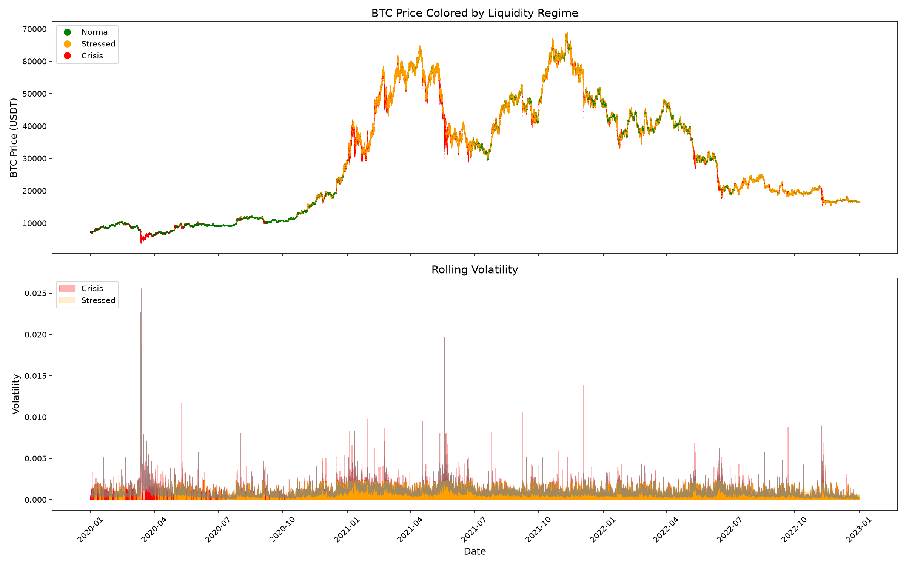
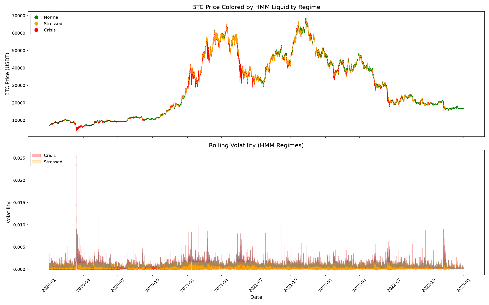

# BTC Liquidity Regime Detection

Detecting market liquidity regimes in Bitcoin using unsupervised machine learning on microstructure features. The pipeline ingests three years of 1-minute BTC/USDT data, engineers liquidity and volatility features, and classifies every minute into one of three regimes — **Normal**, **Stressed**, or **Crisis** — using a Gaussian Mixture Model (GMM) and a Hidden Markov Model (HMM), then compares the two.

## What this project does

- Downloads 36 months of 1-minute OHLCV data (2020–2022) from the Binance public data repository
- Engineers four microstructure features: returns, Amihud illiquidity, volume imbalance, and rolling volatility
- Fits two unsupervised models (GMM and HMM) to label market regimes without any ground-truth labels
- Validates that the high-stress regime coincides with the major crypto dislocations of the period
- Compares the two models on cluster separation and temporal persistence

## Data

| Item | Detail |
|------|--------|
| Source | Binance Vision (`data.binance.vision`), public, no API key |
| Asset | BTC/USDT spot |
| Granularity | 1-minute OHLCV bars |
| Period | January 2020 – December 2022 |
| Rows | ~1.58 million |

BTC/USDT was chosen for being the most liquid crypto pair, trading 24/7 (more regime transitions than equities), with free, clean, well-documented historical data. The 2020–2022 window was chosen because it contains all three regime types, including three major liquidity dislocations: the COVID crash (March 2020), the LUNA/UST collapse (May 2022), and the FTX collapse (November 2022).

## Features

| Feature | Formula | What it captures |
|---------|---------|------------------|
| Return | `close.pct_change()` | Instantaneous price movement per minute |
| Amihud illiquidity | `\|return\| / dollar_volume` | How much price moves per dollar traded — a proxy for liquidity |
| Volume imbalance | `(taker_buy_vol / volume) * 2 - 1` | Directional pressure, from −1 (all selling) to +1 (all buying) |
| Rolling volatility | `return.rolling(60).std()` | Standard deviation of returns over the past hour |

## Models

**Gaussian Mixture Model (GMM)** — assumes the data is generated by a mixture of three Gaussian distributions. Classifies each minute independently with no memory of the previous state. Sharp separation in feature space, but temporally noisy labels.

**Hidden Markov Model (HMM)** — adds a transition matrix encoding the probability of moving between regimes. Labels the entire sequence jointly (Viterbi), producing temporally coherent regimes at the cost of softer feature-space separation.

The HMM transition matrix learned strong persistence — roughly 97% probability of staying in Normal, 96% in Stressed, and 85% in Crisis per minute — confirming that regimes persist rather than flicker.

## Results




### GMM (4 features)

| Regime | Volatility | Imbalance | Count | % of time | Label |
|--------|------------|-----------|-------|-----------|-------|
| 0 | 0.0005 | -0.0310 | 591,439 | 37.5% | Normal |
| 1 | 0.0009 | -0.0088 | 850,147 | 53.9% | Stressed |
| 2 | 0.0022 | -0.0140 | 134,033 | 8.5% | Crisis |

### HMM (4 features)

| Regime | Return | Amihud | Imbalance | Volatility | Count | % of time | Label |
|--------|--------|--------|-----------|------------|-------|-----------|-------|
| 0 | -1.6e-07 | 7.7e-10 | -0.0212 | 0.000468 | 705,530 | 44.8% | Normal |
| 1 | -1.1e-06 | 5.0e-10 | -0.0157 | 0.000983 | 628,392 | 39.9% | Stressed |
| 2 | 1.1e-05 | 2.0e-09 | -0.0121 | 0.001790 | 241,697 | 15.3% | Crisis |

### HMM Transition Matrix

| From \ To | Normal | Stressed | Crisis |
|-----------|--------|----------|--------|
| Normal | 0.972 | 0.003 | 0.025 |
| Stressed | 0.005 | 0.964 | 0.031 |
| Crisis | 0.067 | 0.085 | 0.848 |

### Regime distribution

| Regime | GMM count | GMM % | HMM count | HMM % |
|--------|-----------|-------|-----------|-------|
| Normal | 591,439 | 37.5% | 705,530 | 44.8% |
| Stressed | 850,147 | 53.9% | 628,392 | 39.9% |
| Crisis | 134,033 | 8.5% | 241,697 | 15.3% |

GMM labels 8.5% of minutes as Crisis; HMM labels 15.3%. The HMM's transition
matrix enforces persistence, so once it enters a regime it tends to stay,
producing longer continuous crisis blocks rather than isolated spikes.

### Feature ablation: volatility-only vs full model

A volatility-only HMM agrees with the full 4-feature HMM on only **44.8%** of
minutes (random chance with 3 regimes ≈ 33%). This shows the liquidity and
imbalance features substantially change regime assignments — they are not
redundant with volatility, though volatility remains the single strongest driver.

## Honest interpretation

**What the model actually detects.** The "Crisis" regime is not a named-crash detector. It detects high-volatility, low-liquidity *minutes*. These cluster heavily around the well-known crashes (COVID, LUNA, FTX all light up clearly) but also appear throughout the sample as smaller localized stress events — weekend liquidation cascades, leverage unwinds, news spikes. Calling this "crash detection" would overclaim. It is high-stress regime detection, and the famous crashes are simply the densest concentrations of crisis-labeled minutes.

**Volatility does most of the work.** A volatility-only model reproduces the large majority of the full model's labels. At 1-minute frequency, Amihud (designed for daily equity data) contributes little because per-minute dollar volume is enormous and swamps the signal. This is reported as a finding, not hidden.

**GMM vs HMM is a trade-off, not a winner.** GMM separates clusters more cleanly in feature space but produces isolated, flickering labels. HMM produces persistent, temporally coherent regimes but with softer separation and a higher crisis base rate (~15% vs ~9%). The right model depends on use case: HMM for alerting and risk overlays where persistence avoids false alarms; GMM for static statistical characterization.

### Model comparison

| Model | Silhouette (20k sample) | Temporal persistence |
|-------|------------------------|----------------------|
| GMM | 0.0532 | None (no time memory, flickers) |
| HMM | 0.0527 | Strong (97/96/85% self-transition) |

Both models score nearly identically on silhouette (~0.053), and both scores are
low in absolute terms. This is expected: market regimes form a continuum rather
than well-separated clusters, so volatility slides smoothly from normal to crisis
with no clean gap between states. Silhouette therefore cannot distinguish the two
models — they partition the feature space equally well.

The models differ decisively on temporal coherence. GMM treats each minute
independently and flickers between regimes; HMM's transition matrix enforces
persistence, producing long continuous regime blocks. Since the two are tied on
cluster separation, the deciding factor is use case: for a liquidity risk system
where flickering labels trigger false alarms, HMM's persistence makes it the
stronger choice despite the marginally lower silhouette.

## Limitations

- **OHLCV approximates microstructure.** True microstructure analysis needs tick or Level-2 order book data. Bid-ask spread and Kyle's lambda cannot be computed exactly from 1-minute bars; imbalance and Amihud here are approximations.
- **No out-of-sample validation.** The models are fit and predicted on the same window. A production version would train on 2020–2021 and test on 2022 to confirm the learned volatility thresholds generalize rather than being specific to one period.
- **Manual regime labeling.** The three states are labeled Normal/Stressed/Crisis by sorting on volatility. A different researcher might label them differently; the number of regimes (3) was a modeling choice, not data-determined.
- **Crypto-specific.** Findings may not transfer to equities, which have open/close effects, earnings events, and different liquidity dynamics.
- **DBSCAN was considered and rejected** — it does not produce a fixed regime count, scales poorly to 1.5M rows, and labels most points as a single dense blob plus noise.

## Possible extensions

- Replace GMM with HMM as primary (done) and add K-Means as a third baseline
- Add tick / Level-2 data to compute true spread, signed order flow, and Kyle's lambda
- Walk-forward out-of-sample validation (train 2020–2021, test 2022)
- Regime-conditioned strategy backtest (e.g. run momentum only in Normal regime, reduce exposure in Crisis) with transaction costs
- Extend to ETH/SOL to test whether regimes are systemic (correlated across assets) or idiosyncratic
- Real-time pipeline via Binance WebSocket updating the live regime label each minute

## How to run

```bash
pip install pandas numpy requests scikit-learn matplotlib hmmlearn

python load_data.py        # downloads + assembles raw data  -> step1_raw.pkl
python features.py         # engineers features              -> step2_features.pkl
python regime_hmm.py       # fits HMM, labels regimes         -> step3_hmm_regimes.pkl
python visualize_hmm.py    # plots price + volatility by regime
python compare_features.py # volatility-only ablation + model comparison
```

Each step saves a pickle and the next step loads it, so the expensive HMM fit runs only once.

## Repo structure

```
.
├── load_data.py          # download + assemble Binance data
├── features.py           # feature engineering
├── regime_gmm.py         # Gaussian Mixture Model
├── regime_hmm.py         # Hidden Markov Model
├── visualize_hmm.py      # plotting
├── compare_features.py   # ablation + model comparison
├── regime_plot.png       # GMM result
├── regime_plot_hmm.png   # HMM result
└── README.md
```

## References

- Amihud, Y. (2002). *Illiquidity and stock returns: cross-section and time-series effects.* Journal of Financial Markets.
- Kyle, A. (1985). *Continuous auctions and insider trading.* Econometrica.
- Cont, R. (2001). *Empirical properties of asset returns: stylized facts and statistical issues.* Quantitative Finance.
- Jegadeesh, N. & Titman, S. (1993). *Returns to buying winners and selling losers.* Journal of Finance.

---

*independant project for learning quantitative finance and unsupervised ML. Not investment advice.*
